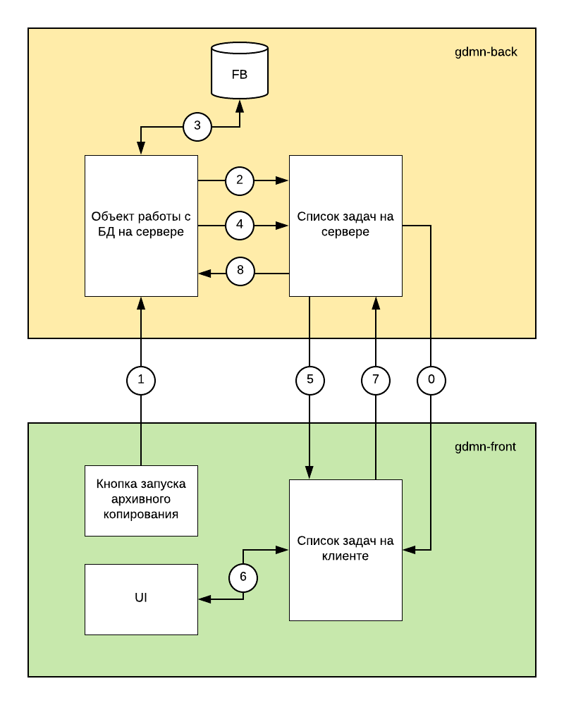

Пользователь может запускать на сервере выполнение длительных задач. Например:

* Архивирование/восстановление базы данных (8-10 часов на базах крупных предприятий)
* Расчет заработной платы (до 6 часов)
* Построение тяжелого отчета (2-4 часа)

Задача имеет:

* Название и уникальный идентификатор.
* Права доступа (т.е. кто может просматривать состояние задачи и управлять ею). Например, создатель задачи и Администратор системы могут видеть ее в списке и управлять ею. Остальным пользователям она будет невидима.
* Тип: системная/пользовательская, управляемая/не управляемая и т.п.
* Состояние: Создана, но еще не запущена, Выполняется, На паузе, Успешно завершена, Прервана системой, Прервана по требованию пользователя, Завершена с ошибкой. В последнем случае дополнительно предоставляется код ошибки и сообщение.
* Лимит времени выполнения. Если он превышен, а задача не выполнена, то система прерывает ее.
* Приоритет в соответствии с которым система выделяет ресурся на выполнение задачи.
* Время старта, время завершения, время постановки на паузу. 
* Лог. Например, если восстановление БД запустить в режиме подробного отображения хода процесса, то сервер будет документировать и сообщать клиенту каждый предпринятый шаг.
* Прогресс, ориентировочное время завершения.

### Прогресс выполнения задачи

* Задача может быть представлена в виде последовательности действий (шагов). Например, расчет заработной платы по предприятию состоит из расчета заработной платы по каждому из сотрудников предприятия.
* Вес шага -- это оценка затрат на его выполнение выражаемая целочисленным коэффициентом. Шаги могут быть с одинаковом весом или разным. Например, в гипотетическом процессе обработки файла первый шаг -- считывание с диска может иметь вес 1, второй шаг -- обработка данных -- вес 10 (т.е. в десять раз дольше чем считывание), и наконец запись на диск, шаг номер 3, имеет вес 2 (т.е. в два раза дольше чем чтение).
* При создании задачи мы указываем суммарный вес всех ее шагов.
* В процессе пошагового выполнения задачи мы сообщаем системе о старте шага (его весе и названии) и о его завершении.
* Указанная выше информация может быть использована для расчета ориентировочного времени выполнения задачи.

### Список задач на сервере

* Список задач хранится на сервере.
* Клиент получает список своих задач после входа (логина) на сервер.
* Клиент получает уведомления об изменении в списке задач (изменился/завершился очередной шаг, задача завершилась, произошла ошибка и т.п.).
* Клиент может отображать ход выполнения задачи в кратком и развернутом виде.

### Потоки данных

0. После логина клиент получает список относящихся к нему выполняющихся или выполненных задач с сервера и хранит их в своей внутренней структуре. Например, человек может запустить процесс (архивирования, расчета, построения отчета и т.п.) на ночь, а утром придти, залогиниться и узнать состояние задачи, выполнилась она или нет. 
1. Пользователь запускает процесс архивного копирования.
2. Код работы с базой данных на сервере создает в списке новую задачу в состоянии Создана.
3. Код работы с базой данных обращается к API СУБД для начала процесса архивирования. 
4. В процессе получения сообщений от СУБД меняется и статус задачи. Например, Выполняется, Завершена, Ошибка и т.п.
5. Изменения в списке задач передаются на клиента.
6. Где отображаются в UI. Например, показываем процент выполнения, количество активных задач и т.п.
7. Для управляемых задач пользователь может инициировать команды: Пауза, Прервать, Уменьшить приоритет, Увеличить приоритет и т.п.
8. Команды пользователя передаются объекту работы с базой данных.

### Сделать!

* Автозадачи
* Задачи по расписанию

### См также

* http://gsbelarus.com/gs/wiki/index.php/GdccGlobal.TgdccProgress