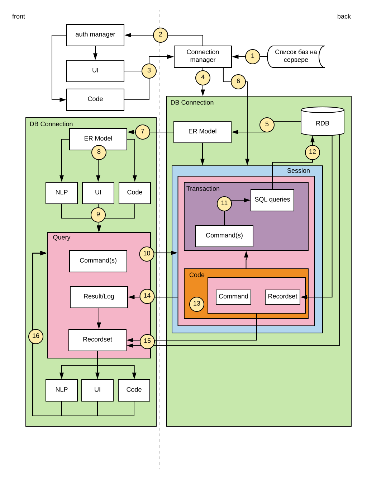

## Структура взаимодействия объектов

1. Сервер хранит список баз данных в JSON файле или отдельной базе данных.
2. Список баз данных передается на клиента для организации пользовательского интерфейса в процессе логина.
3. Подключение к базе данных может происходить из пользовательского интерфейса или программного кода. В последнем случае одновременно может быть установлено несколько подключений к разным базам данных, в т.ч. и расположенным на разных серверах. 
4. Проверяется существование объекта типа **DB Connection** для выбранной базы данных. Если нет, то создаем его. Объект обслуживает на стороне сервера все подключения к конкретной базе. После закрытия последнего подключения, он существует ещё заданное время (кэширование), после чего автоматически уничтожается. Время создания объекта **DB Connection** может быть значительным. Следует учесть это при реализации протокола логина пользователя, чтобы он не падал по таймауту.
5. При создании объекта **DB Connection** строим **ER Model** на основании структуры реляционной базы данных и информации из дополнительных таблиц.
6. Внутри объекта **DB Connection** создается объект **Session**, который обслуживает одно внешнее подключение к базе данных.
7. В рамках процедуры логина пользователя **ER Model** сериализуется и передается на клиента.
8. **ER Модель** используется для организации пользовательского интерфейса, анализа текста в NLP и внутри программного кода для доступа к данным.
9. Взаимодействие с сервером осуществляется с помощью объекта **Query**, который формируется по запросу из модуля NLP, пользовательского интерфейса или программного кода. Внутри себя объект содержит список команд, которые могут включать: команды управления транзакциями, команды создания/изменения/удаления данных, команды выборки данных, команды выполнения программного кода на сервере.
10. Объект **Query** асинхронно передает на сервер команды для выполнения. На стороне сервера в рамках сессии создается объект, который будет отвечать за выполнение команд **Query** и отсылку результата.
11. На основании **ER Модели** и полученной команды сервер строит SQL запрос (или последовательность SQL запросов).
12. Запрос(ы) выполняются на сервере базы данных в контексте транзакции (или вложенной транзакции, SAVEPOINT). Транзакция может стартовать/комитится/откатываться вручную, по командам с клиентской части, или автоматически.
13. Команда также может запускать выполнение программного кода на сервере, который в свою очередь может создавать новые **Query** для доступа к базе данных, получать результаты и обрабатывать их. 
14. Результат выполнения, успех или ошибка, передается на клиента.
15. Если выполнение команды -- выборка данных из базы данных или формирование набора данных в программном коде, то данные передаются на клиента и сохраняются в объекте **Recordset** для отображения в пользовательском интерфейсе или обработке в программном коде.
16. Взаимодействие пользователя с интерфейсом может приводить к внесению изменений в первоначальные команды объекта **Query** и повторному выполнению их на сервере.

## Примерный типовой сценарий взаимодействия пользователя с системой

1. Пользователь открывает страницу в браузере.
2. Если ему доступны несколько баз данных, то выбирает базу для подключения.
3. Вводит свой логин и пароль.
4. На экране список сущностей (как в Гедымине Исследователь). Он выбирает **Организации** и щелкает по ним мышью.
5. Открывается список организаций из базы данных в табличном виде.
6. Пользователь перемещается по гриду с помощью курсора, меняет сортировку, открывает/скрывает колонки, ищет нужные строки.
7. Выбрав нужную ему запись он может открыть ее для просмотра/изменения в отдельной странице.
8. Изменения в данных отображаются на экране и отсылаются на сервер для изменения в базе данных. Отсылка асинхронная. Если изменение данных завершилось ошибкой, то организуется соответствующее оповещение пользователя и данные в рекордсете откатываются к исходному состоянию или перечитываются с сервера.

