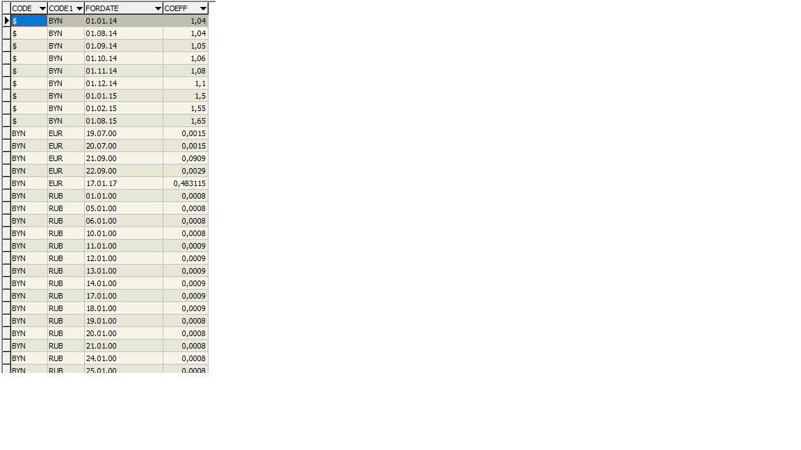

Репозиторий gdmn-grid-demo содержит экспериментальную версию грида и рекордсета. Мы поместили все компоненты и тестовую программу в один репозиторий для ускорения процесса разработки и отладки. По мере завершения, исходный код грида будет скопирован в выделенный репозиторий gdmn-grid. Исходный код рекорд-сета тоже будет выделен в отдельный проект, либо добавлен к другому репозиторию.

Что сделано:

1. Динамическое создание/удаление рекордсета. Обращение к рекорд сету, по его названию.
2. Динамическое создание/удаление грида. Обращение к гриду по названию.
3. Навигация в гриде с клавиатуры и мышью.
4. Включение/выключение фиксированного заголовка и подножия.
5. Фиксированные колонки в начале и в конце грида.
6. Изменение размеров, скрытие и перетаскивание колонок.

Расположение исходного кода:

**/src/grid**

* Презентационные компоненты грида и панели управления.
* Actions.
* Reducer.
* Функция connectGrid, которая создает грид, связанный с reducer, принимая на вход имя и рекордсет.

В будущем, исходный код из этой папки будет скопирован в отдельный проект **gdmn-grid**.

**/src/recordSet**

Рекордсет, actions и reducer для него. Рекордсет реализован как объект, содержащий описание полей и данные -- массив записей одинаковой структуры.

```ts
import { List } from "immutable";

export enum TFieldType {
  String = 0,
  Integer,
  Boolean,
  Currency,
  Float,
  Date
};

export interface IFieldDef {
  fieldName: string;
  dataType: TFieldType;
  size?: number;
  precision?: number;
  required?: boolean;
  readOnly?: boolean;
  calculated?: boolean;
  mask?: RegExp;
  caption?: string;
  shortCaption?: string;
  description?: string;
};

export type TDataType = string | number | boolean | Date | null;

export interface IDataRow {
  [fieldName: string]: TDataType;
};

export type Data<R extends IDataRow> = List<R>;

export interface IRecordSet<R extends IDataRow = IDataRow> {
  fieldDefs: IFieldDef[];
  data: Data<R>;
};
```

**/src/app**

Демо приложение, которое позволяет:

* Загружать/удалять рекордсеты. 
* Создавать/удалять гриды.

**/src/util**

Вспомогательная программка для скачивания данных с сайта НацБанка. JSON файлы с уже скачанными демо-данными, которые мы подключаем в демо проект.

Что дальше:

1. Навигация по рекордсету, курсор

Сейчас позиция курсора и список выделенных записей находится внутри грида (в reducer грида). Наверное стоит подумать о переносе их в рекордсет или выделении в отдельный объект. Полностью или частично. Например, позиция текущей записи в рекордсете, а выделенное поле -- в гриде.

Реализовать пример:

В левой части экрана список валют. В правой части экрана форма с подробными данными по выбранной валюте. При перемещении по списку правая форма обновляется.


2. Сортировка

По щелчку по заголовку колонки сортировать данные рекордсета. Так сделано в Гедымине. Тут мы хотим пойти дальше и дать возможность сортировки по нескольким полям. По каждому из которых можно раздельно указать порядок сортировки. Надо подумать где хранить информацию о сортировк данных. В рекордсете? Как реализовать интерфейс, когда сортировка задается по нескольким полям. Посмотреть как сделано это в Microsoft Excel.


3. Поиск 

По вхождению подстроки, по указанной колонке. Находим, перемещаем на найденную строку курсор.

4. Редактирование, добавление, удаление

Возвращаясь к интерфейсу пользователя из п.1, в правой форме добавляем кнопки: Добавить, Удалить, Сохранить, Отмена. По ним выполняются соответствующие действия над данными.


5. Агрегатные функции

Агрегатные функции выполняются над всеми данными (группой данных). Для начала достаточно пяти: SUM, AVG, COUNT, MIN, MAX. 

Задавать агрегатные функции, вычислять и выводить в подножии таблицы, если оно отображается.


6. Группировка строк

Пусть исходные данные выглядят следующим образом:



Для группировки мы задаем:

* Поле или поля, по которым возможна группировка данных. Они должны идти вначале таблицы.
* Функции для значений полей...
