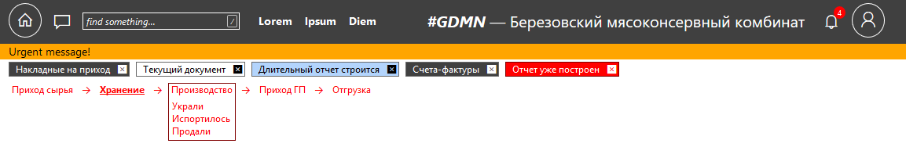

Основные принципы при организации интерфейса:

* Максимум пространства работе, минимум нефункциональных, статичных, декоративных элементов.
* Максимум информации на экране, средние и мелкие шрифты, небольшие межстрочные интервалы и т.п.
* Простые начертания и лаконичные геометрические решения.
* Неброские, спокойные цвета. Только необходимая минимальная анимация и прочие эффекты оформления.
* Чёткая и однозначная навигация: как попал на этот экран, что здесь делать, куда можно перейти дальше.

GDMN является single page application.

Организация страницы:

1. Заголовок
2. Рабочая область
3. Подножие

В рабочей области располагаются одна или несколько **открытых форм**.

Некоторые виды форм:

1. Форма для табличного отображения данных. Как правило результата выполнения запроса или списка сущностей из базы.
2. Форма для просмотра/редактирования выбранного экземпляра сущности.
3. Форма просмотра бизнес-процесса.
4. Форма просмотра отчета (выходной формы).
5. Форма с "живыми" графиками и датчиками (показателями), dashboard.
6. Форма настройки (программирования) бизнес-логики.  и т.д.

Формы с которыми работает пользователь называются **активными**. Форма может быть в открытом состоянии (отображается на экране, в рабочей области) или в закрытом. Список активных форм выводится в специальной строке Заголовка.

## Заголовок страницы

Слева направо, сверху вниз:

1. Пиктограмма перехода на [стартовую форму](#стартовая-форма).
2. Пиктограмма перехода на [панель NLP](#панель-NLP).
3. [Поле поиска](#поле-поиска). 
4. Строка меню из 3-5-ти основных команд платформы.
5. Название и логотип предприятия.
6. Пиктограмма вызова списка сообщений и нотификаций системы с указанием количества непрочитанных.
7. Пиктограмма для открытия меню Account с параметрами учетной записи пользователя и командами, к ней относящимися. Например, logout.
8. Строка с важным сообщением. Присутствует только если такое сообщение задано. Убрать с экрана нельзя.
9. Список активных форм программы. Визуально выделяются: текущая форма (где находится input focus); открытые формы; формы, где выполняется длительный процесс; формы, где закончился длительный процесс.
10. Строка навигации. 
  * При работе с документами (хозяйственными операциями) здесь показывается положение текущей операции в цепочке операций бизнес-процесса. Навигация двухмерная. Т.е. если на определенном шаге бизнес-процесса возможны разные операции, то их список показывается в выпадающем меню.
  * При работе с прочими формами показывается положение этой формы в иерархии меню программы. Например, по аналогии с Гедымином, *Администратор → Атрибуты → Таблицы*.

## Поле поиска  

Через поиск в **gdmn** можно будет найти: 
* Функцию системы
* Команду меню
* Страницу
* Документ
* Бизнес-процесс
* Отчёт
* Пользователя и т.п.

А так же:

* Объект из базы данных.
* Объект из любой системы на платформе **gdmn**, открытый для публичного доступа.

В правой части поля поиска находятся кнопки для вызова формы расширенного поиска и определения области поиска.

## Стартовая форма

Содержит:

1. Закрепленные (pinned), наиболее нужные пользователю, формы и датчики.
2. Историю последних форм, с которыми работал пользователь.
3. Доступ ко всем функциям и объектам платформы и прикладного решения. Сгруппированным по функциональному назначению.

Данные на стартовой форме отображаются в виде плиток разного размера.

Плитки могут отображатся в сокращенном (свернутом) виде, когда показывается только название и в полном (развернутом) когда показывается уменьшенная копия внешнего вида соответствующей формы.

Стартовая форма проматывается вниз для отображения всех объектов.

## Панель NLP

Панель NLP открывается в левой части экрана и содержит диалог между пользователем и системой, визуально отображаемый как диалог в популярных приложениях мессенджерах.

