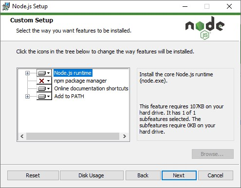
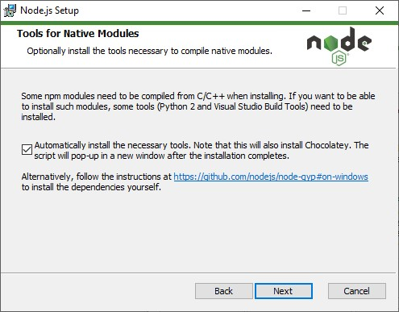
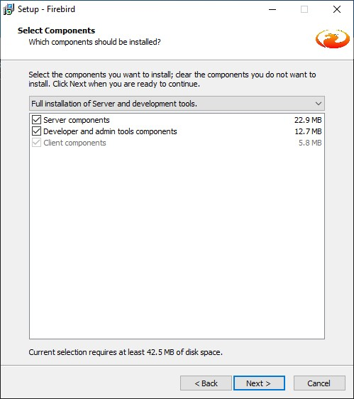
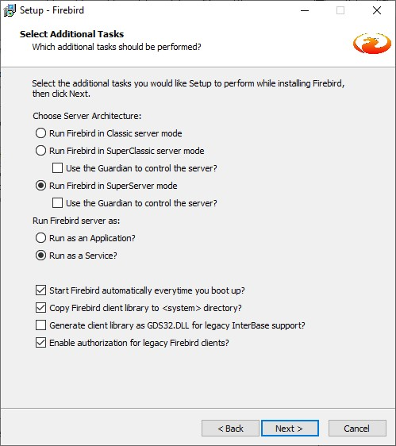
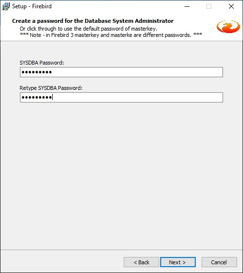

# Установка и запуск сервера и клиента платформы GDMN

## Устанавливаем Node 64-bit

Необходима версия [Node 12](https://nodejs.org/en/download/) или новее.

Мы не рекомендуем устанавливать `npm` так как проект `gdmn` использует менеджер пакетов `yarn`:



Для компиляции нативного драйвера Firebird в Node необходимо установить `Windows Studio Build Tools`:



## Устанавливаем Yarn

Инстолятор [Yarn](https://yarnpkg.com/en/docs/install) на официальном сайте.

## Устанавливаем и запускаем службу Firebird 3 64-bit

Берем инстолятор [Firebird 3](https://www.firebirdsql.org/en/server-packages/). GDMN не будет работать с более ранними версиями Firebird!

Устанавливаем серверную и клиентскую части:



Установите флаги, как показано на скриншоте ниже:



Пароль для учетной записи `SYSDBA`. Во всех более ранних версиях Firebird пароль по-умолчанию был `masterkey`. Мы используем его на последующих шагах инстоляции и в файлах настроек. Если вы здесь укажете другой пароль, не забудьте прописать его в нужных файлах и использовать при вызове команд, которые будут указаны далее.



Под `Windows` добавим путь к папке, где установлен Firebird 3, к системной переменной `PATH`. Это облегчит нам в будущем вызов утилиты `gbak` для распаковки базы данных из архива.

## Устанавливаем библиотеку GUDF.DLL 64-bit

Библиотеку следует взять по [этой ссылке](http://gsbelarus.com/pw/downloads/gedemin-platform/gudf.dll-64-bit/), распаковать и выложить в подкаталог `UDF` основного каталога, где был установлен сервер `Firebird 3`.

### Дополнительная настройка для Mac OS

Выполняем из командной строки:

````sh
$ firebirdHome='export FIREBIRD_HOME="/Library/Frameworks/Firebird.framework/Resources"'
$ grep -q -F "$firebirdHome" ~/.bash_profile || echo "$firebirdHome" >> ~/.bash_profile

$ firebirdBin='export PATH=$PATH:$FIREBIRD_HOME/bin'
$ grep -q -F "$firebirdBin" ~/.bash_profile || echo "$firebirdBin" >> ~/.bash_profile

$ mkdir -p /usr/local/lib 
$ ln -s /Library/Frameworks/Firebird.framework/Versions/A/Firebird /usr/local/lib/libfbclient.dylib
````

Выдать пользователю `Firebird Database` права на директорию где локально лежат базы данных Firebird.

## Устанавливаем Git

Дистрибутив [Git](https://git-scm.com/downloads) на официальном сайте.

     
## Получаем исходный код

Создаем или переходим в папку, где будут расположены исходники. Из командной строки выполняем:

```sh
$ git clone https://github.com/gsbelarus/gdmn.git
$ cd gdmn
```

## Скачиваем и распаковываем шаблоны баз данных и тестовую базу

> Внимание! Так как для **Mac OS** нет библиотеки `GUDF.DLL`, нельзя будет восстановить из архива шаблонные базы данных и тестовую базу данных, как указано ниже.

1. Перейдем в папку `/gdmn/src/gdmn-back/databases/` 
2. Скачаем [архив](http://gsbelarus.com/gs/content/gdmn/databases.7z) и распакуем. 
3. Должно получиться две папки `templates` и `test`.
4. Открываем окно командной строки и для _каждого_ файла `*.BK` в вышеуказанных папках выполняем команду `gbak`. Например, если в папке `test` находится файл `TEST.BK`, то переходим в нее и выполняем:
  ```sh
  gbak -r TEST.BK TEST.FDB -user SYSDBA -password masterkey
  ```
5. Копируем файл `templates.config.json.sample` и меняем ему имя на `templates.config.json`

> Обратите внимание, что утилита `gbak` находится в папке сервера Firebird 3. Пароль `masterkey` может отличаться, если при установке `Firebird 3` вы ввели другое значение.

## Настраиваем параметры проекта

1. В корневой папке `gdmn` находим файл `testConfig.json.sample` и копируем его с именем `testConfig.json`. Открываем на редактирование и настраиваем подключение к базе данных для автоматического тестирования:
  ```json
  {
    "dbDetails": [
      {
        "alias": "test",
        "driver": "firebird",
        "connectionOptions": {
          "server": {
            "host": "localhost",
            "port": 3050
          },
          "username": "SYSDBA",
          "password": "masterkey",  <--укажите другой пароль, есливы меняли его
          "path": "c:\\gdmn\\src\\gdmn-back\\databases\\test\\TEST.FDB" <--укажите другую папку, если исходники GDMN установлены не в корне диска c:\
        }
      }
    ]
  }
  ```
2. Файл ```/gdmn/src/gdmn-back/config/development.json``` -- это параметры серверной части платформы `GDMN`. В частности, здесь прописываем пароль учетной записи `SYSDBA`, если он отличается от стандартного `masterkey`. Там же указываются и другие параметры подключения к серверу `Firebird 3`, если они отличаются от заданных по-умолчанию.
3. Параметры клиентской части платформы находятся в файле ```/gdmn/src/gdmn-front/configs/config.json```. Как правило, нет необходимости изменять значения, предложенные по-умолчанию.

## Устанавливаем зависимости и компилируем проект

В корневой папке проекта из командной строки выполнить:

```sh
$ yarn
$ yarn build
```

## Запускаем автоматическое тестирование

```sh
$ yarn test
```

## Запускаем проекты

Для запуска всех проектов выполнить:

    $ yarn start

Для запуск одного из проектов, где ```name``` - имя проекта, выполнить:

    $ yarn start:name

Например, команды:

    $ yarn start:gdmn-back
    $ yarn start:gdmn-front

Запустят серверную и клиентскую части платформы.

Для быстрого запуска бэка и фронта под операционной системой `Windows` можно выполнить файл `s.bat` в корневой папке.

## Дополнительно

Если требуется обновить демо данные для **gdmn-grid-demo** выполнить:

    $ cd src/gdmn-grid-demo
    $ yarn download-data -force
    $ cd ../..
